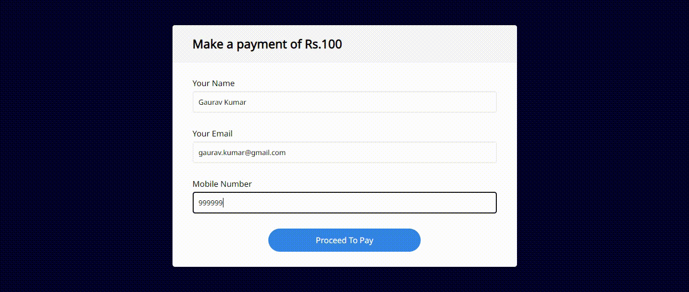

# Razorpay-Java-Integration

A web-app to demonstrate the process of integrating **Razorpay Payment Gateway** with **Java SDK**, which enables users to carry out e-payments using various options available such as net-banking, UPI, debit card etc. 

***

## Visit : [https://razorpay-java-integration.herokuapp.com/](https://razorpay-java-integration.herokuapp.com/)

***
## Demo

***
## Tech Stack

***

 ## How to run the project?
 import project from local directory into Eclipse IDE and run the project on server.

**Note :** 
- Configure your tomcat server to run on the port **8081**.
- Replace present api key and secret with your own set of api key and secret, in order to make project up and running.

 ***

 ## Show your support

Give a ⭐ if you found this project useful.

---

